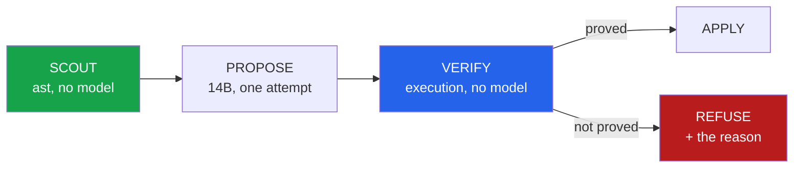

<h1 align="center">repo-surgeon (Python · ast · differential testing · mutation testing · Ollama)</h1>
<p align="center"><i>A codebase migration tool whose output is the changes it refused</i></p>

<p align="center">
  <a href="#the-through-line">The through-line</a> &middot;
  <a href="#the-result">The result</a> &middot;
  <a href="docs/RESULTS.md">Full results</a> &middot;
  <a href="#the-ladder">The ladder</a> &middot;
  <a href="#what-it-refused">What it refused</a> &middot;
  <a href="#run-it">Run it</a> &middot;
  <a href="#what-this-does-not-do">What it does NOT do</a> &middot;
  <a href="#problems-hit-while-building-this">Problems hit</a>
</p>

<p align="center">
  
  
  
  
  
  <a href="LICENSE"></a>
</p>

---

## The through-line



Point it at a repository and a mechanical goal - *`os.path` → `pathlib`*, *`%`-formatting →
f-strings* - and it finds every site, rewrites each enclosing function with a local model,
and then tries to **prove the rewrite changed nothing**. Anything it cannot prove is
refused, with the reason attached.

The model appears exactly once, in the middle, and nothing it says is treated as evidence.
That is a decision taken from measurements rather than taste. In
[code-llm-lab](https://github.com/hammasbuilds/code-llm-lab) an LLM reviewing code ran at
**44.8% precision** and flagged human-written reference solutions **38.8%** of the time; a
model's stated confidence did not separate its correct answers from its wrong ones. So
neither reviews nor confidence are in this loop.

> **A migration tool that reports what it changed is a diff. One that reports what it
> refused, and why, is a reason to trust the diff.**

## The result

Run against [`pypa/build`](https://github.com/pypa/build) - the official PyPA build
frontend - migrating `os.path` to `pathlib`:

```
24 sites in 10 functions across 3 files

proposed 10   landed 2 (20%)   REFUSED 8 (80%)

refused at:
  signature         1   changed the function's interface
  differential      7   could not be proven equivalent
```

**Two changes landed. Both are provably behaviour-identical on every input tried, and
`build`'s own test suite is no worse than it was.**

```diff
- built.append(os.path.basename(out))
+ built.append(Path(out).name)

- resolved = os.path.join(source_dir, path)
- if not os.path.isdir(resolved):
+ resolved = Path(source_dir) / path
+ if not resolved.is_dir():
```

That first one is worth a second look. `os.path.basename` and `Path(...).name` are **not**
equivalent in general - they disagree on a trailing slash, where `basename("a/b/")` is `""`
and `Path("a/b/").name` is `"b"`. It landed because on this function's actual inputs, 38 of
40 argument sets exercised it and all 38 agreed. The tool does not claim the rewrite is
universally safe. It claims it was checked.

## The ladder

Five rungs, ordered by cost. A verdict names the **first** rung a proposal failed.

| | rung | what it establishes | model? |
|---|---|---|:--:|
| 1 | `syntax` | it parses | no |
| 2 | `signature` | same name, parameters, defaults, decorators **and annotations** | no |
| 3 | `differential` | old and new agree on every input tried | no |
| 4 | `mutation` | the change did not make the function less distinguishable | no |
| 5 | `suite` | the repo's own tests are no worse than the baseline | no |

**Rung 3 is what the tool is for.** Both versions are loaded into separate module
namespaces in one process and called on the same arguments. An exception counts as a
result - a function that raised `KeyError` and now returns `None` has changed behaviour,
and comparing only return values would call that agreement.

The inputs come from three places, because this rung is only as good as the values it
tries. Random values almost never satisfy a real function's preconditions, so both sides
raise, the two "agree", and the change lands unverified. Type-driven values are tidy, and
tidy values are exactly where `os.path` and `pathlib` agree. So:

1. **Harvested from the target repo's own tests** - every literal, indexed by the keyword
   it was passed as. Real values from the real domain. `build` gave up 113 of them.
2. **Type-driven**, from the annotation where there is one.
3. **A hand-written corner pool** per parameter name, which is where the known divergences
   live: `""`, `"a/b/"`, `".bashrc"`, `"archive.tar.gz"`, `"/abs"`, `"a/../b"`.

Arguments vary **one at a time** around a baseline, so a witness is immediately readable:
exactly one value differs, so that value is the cause.

**Rung 5 runs once**, over everything that cleared 1-4, against a baseline taken before
anything was touched. A repo whose suite is already red is normal; blaming its existing
failures on whatever change happened to be applied would make every hunk unlandable.

### Agreement is not the same as proof

If every argument set makes both sides raise, the arguments were wrong for that function
and the run established nothing. That is reported as `inconclusive` and **refused**, not
passed. The distinction is the whole disposition of the tool: treating "no evidence" as
"no problem" is precisely how an unverified change lands.

## What it refused

The refusals are the product. On `build`, the eight break into three kinds:

**Four were refused for lack of evidence.** `main`, `_validate_source_directory` and
friends take objects the harness cannot construct, so every argument set raised on both
sides. Nothing was proven either way, so nothing landed.

**Three were the model inventing an import.** It wrote `from typing import StrPath` - and
`StrPath` is `build`'s own type alias, not a name in `typing`. The proposal does not load
at all:

```
load_error: new: ImportError: cannot import name 'StrPath' from 'typing'
```

**One changed the interface without changing the behaviour.** The rewrite of
`_extract_sdist` turned `archive: StrPath` into `archive: Union[str, Path]`:

```
signature: parameter annotations:
  ('StrPath', 'str', 'StrPath | None') -> ('Union[str, Path]', 'str', 'Union[str, Path, None]')
```

Nothing executable changes. Every test still passes. The package now promises its callers
something different, type checkers downstream will disagree about it, and no test suite
anywhere would have caught it. This one is the reason annotations are part of rung 2 -
it slipped through an earlier version of this tool and landed.

## Run it

```bash
git clone https://github.com/hammasbuilds/repo-surgeon
cd repo-surgeon
uv venv && uv pip install -e ".[dev]"

# free, no model, changes nothing - use it to see if a repo is worth the GPU time
repo-surgeon scout /path/to/repo --rule ospath -v

# propose, verify, apply
repo-surgeon run /path/to/repo --rule ospath --out surgeon-out
```

It edits the working tree in place and **refuses to start on a dirty checkout**, so
`git diff` is the change and `git checkout .` is the undo.

The target repo's own dependencies must be importable - a function whose module imports
`pyproject_hooks` cannot be loaded, and therefore cannot be verified, without it.

Needs Ollama with `qwen2.5-coder:14b`. No API key, no hosted call.

## Layout

```
src/repo_surgeon/
  scout.py          find sites via ast; pick the enclosing function; prune its imports
  propose.py        one model call per function, one attempt
  values.py         argument sets: harvested, type-driven, and hand-written corners
  verify/
    statics.py      rungs 1-2: parses, and still the same function
    differential.py rung 3: run both versions, compare results AND exceptions
    mutation.py     rung 4: did the change make the function less distinguishable
    suite.py        rung 5: the repo's own pytest, against a baseline
    __init__.py     the ladder
  pipeline.py       scout -> propose -> verify -> apply
  ledger.py         resumable JSONL, one row per verdict
  report.py         the evidence table
  rules/            ospath, percent_format
```

## Stack

`Python 3.11+` &middot; `ast` (stdlib) &middot; `subprocess` (stdlib) &middot;
`urllib` (stdlib) &middot; `qwen2.5-coder:14b` via `Ollama` &middot; `pytest` &middot;
`ruff`

**Zero runtime dependencies**, and no orchestration framework. Both are deliberate.

A tool whose entire claim is *"it proves things"* should not require you to trust a
dependency tree in order to believe it. And the obvious framework choice here - LangGraph
with a checkpointer, for the per-hunk state machine and resume - would have added a
dependency, a graph definition and a store to do what [`ledger.py`](src/repo_surgeon/ledger.py)
does in thirty lines. The hard part of this tool is the verification, and no orchestration
library helps with that.

## What this does NOT do

- **It does not touch methods.** A method needs an instance, and constructing one means
  running the code under test. Only module-level functions are in scope, and the scout
  skips the rest rather than failing on them confusingly.
- **It does not prove universal equivalence.** It proves agreement on the inputs it tried.
  Those inputs are chosen to include the known divergences, but "checked" is a weaker and
  more honest claim than "safe".
- **It does not retry.** A refused proposal stays refused. `code-llm-lab` measured
  self-debug loops capturing 100% of their gain in the first two rounds, and 93.3% of
  first-attempt failures surviving both repair and rewrite - so a second attempt at the
  same function buys close to nothing and costs a full generation.
- **One repo, one rule, ten functions.** That is a demonstration, not a study. The tool is
  built to be pointed at more; the numbers above are from one run on one target.
- **It cannot verify what it cannot import.** Missing third-party dependencies in the
  target show up as refusals, and those refusals say more about the environment than about
  the proposal. They are labelled separately for exactly that reason.

## Problems hit while building this

Five real bugs, all in the verification code rather than the model's output - which is the
point: a bug in the thing that judges is how a wrong change lands quietly.

- **The scout found zero sites in `pypa/build` and reported success.** `build` was in the
  skip list as a build-artifact directory, and the target repo is *named* `build` - and
  ships its package at `src/build/`. Silently finding nothing is the worst possible failure
  for a tool like this. Artifact directories are now only skipped at the repo root and only
  when they are not packages.
- **Both versions shared a namespace, so recursion was measured wrong.** Defining old and
  new in one module and keeping a reference to each means the old function's self-call
  resolves through module globals to the *new* one, and the two appear to agree. Each
  version now gets its own namespace. The test pins it: correct isolation gives 8 and 27
  where a leak gives 18.
- **Memory addresses were reported as behaviour changes.** `<Foo object at 0x7f...>` reprs
  differently on every allocation, so any function returning a plain object was a
  guaranteed "disagreement" - and the report presented the address as *proof*. A confident
  false accusation is worse here than a missed finding.
- **Then the fix for that left a second artefact.** With addresses normalised, the two
  namespaces' different `__name__`s still leaked into reprs as `rs_old.Foo` vs `rs_new.Foo`.
  Both namespaces now carry the same name; they are separate objects regardless.
- **An annotation change landed.** Rung 2 compared parameter names and not their
  annotations, so `archive: StrPath` became `archive: Union[str, Path]` and passed every
  executable check. Caught by reading the applied diff, not by a test.

Two more were fixed before they could mislead: the whole module header was carried with
every function, so a function touching nothing but `os.path` was unverifiable whenever an
unrelated import at the top of its file was missing; and the model's imports were spliced
in at the function's line number, dropping `from pathlib import Path` into the middle of
the module once per rewrite.

## Keywords

codemod &middot; codebase migration &middot; automated refactoring &middot; differential
testing &middot; mutation testing &middot; equivalence checking &middot; AST &middot;
pathlib migration &middot; f-string migration &middot; LLM code generation &middot; local
LLM &middot; Ollama &middot; qwen2.5-coder &middot; verified code transformation &middot;
program equivalence &middot; regression detection

## License

MIT - see [LICENSE](LICENSE).
